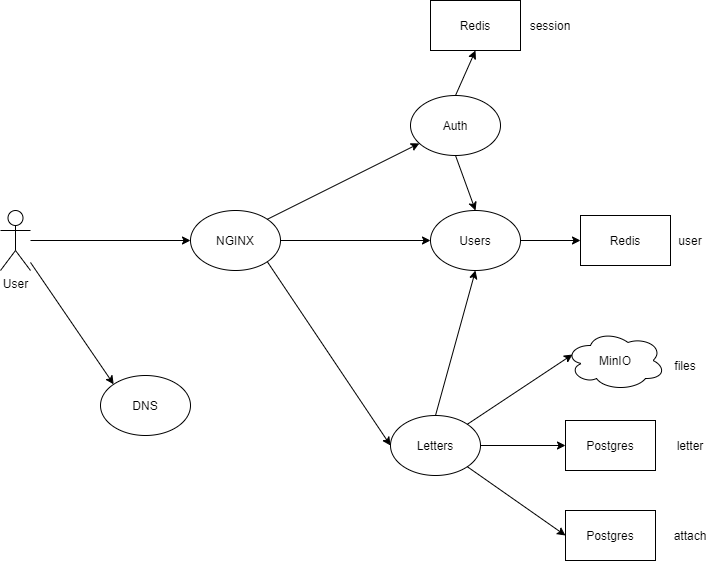

# Highload_Mail_project
## Тема и целевая аудитория
Тема: проектирование высоконагруженного сервиса электронной почты, позволяющего пользователям отправлять и получать письма, которые могут содержать вложения.

Возможности, которые предоставляет пользователю проектируемый сервис:
- Регистрация и авторизация
- Отправка/пересылка писем (письма могут содержать вложения)
- Чтение писем
- Постраничное получение списка последних писем из почтового ящика (последние 50)
- Удаление писем

Согласно [radar.yandex](https://radar.yandex.ru/yandex?month=2021-04), в 2021 году месячная аудитория Яндекс.Почты составляет 16 млн пользователей, а дневная 5.5 млн пользователей.

На основании этих данных обозначим аудиторию проекта:

- Дневная аудитория проекта - 5.5 млн пользователей
- Количество активных аккаунтов - 50 млн (~35% населения России)
- Сервис будет направлен на Российскую аудиторию.

## Расчет нагрузки

Определим данные среднего пользователя почтового сервиса.

Пусть средний пользователь отправляет 3 письма в день, получает 10 писем в день и проверяет почту в среднем [15 раз в день](https://hbr.org/2019/01/how-to-spend-way-less-time-on-email-every-day).

#### RPS по типам запросов:
1. Авторизация:

    Так средний пользователь проверяет почту 15 раз в день (то есть заходит на сайт), то и количество запросов на авторизацию или проверку авторизованности от одного пользователя будет равно 15:
  
    ```RPS = 5.5 * 10^6 * 15 / (24 * 60 * 60) ~ 960```

2. Отправка писем:

    Если считать, что средний пользователь отправляет 3 письма в день, то количество запросов на отправку письма в секунду:
   
    ```RPS = 5.5 * 10^6 * 3 / (24 * 60 * 60) ~ 190```

3. Чтение писем:

    Предполагая, что пользователь читает все полученные за день письма (10 писем):
    
    ```RPS = 5.5 * 10^6 * 10 / (24 * 60 * 60) ~ 636```

4. Постраничное получение списка последних писем из почтового ящика:

    Считая, что пользователь проверяет почту 15 раз в день, получим:
    
    ```RPS = 5.5 * 10^6 * 15 / (24 * 60 * 60) ~ 960```
    
5. Удаление писем:

    Так как по [статистике](https://www.statista.com/statistics/420400/spam-email-traffic-share-annual/) 28% писем являются спамом, то в среднем пользователь будет удалять 3 письма в день:
        
    ```RPS = 5.5 * 10^6 * 3 / (24 * 60 * 60) ~ 190```
    
Итого, получаем среднее количество запросов с секунду: ```RPS ~= 2940```

#### Траффик для различных типов запросов:

Рассчитаем траффик, генерируемый пользователями. Пусть в момент пиковой нагрузки RPS растет в 3 раза.

1. Отправка писем:

    Средний RPS для запросов на отправку писем равен 190. По данным Яндекса, 90% писем не содержат вложений и весят в среднем по 4 кб, остальные 10% имеют вложения и весят в среднем 400 кб. Тогда:
    ```
    Траффик: (190 писем/сек) * (0.9 * 4 * 2^13 + 0.1 * 400 * 2^13) ~ 68 Мбит/c
    Пиковый траффик: 68 * 3 ~ 204 Мбит/c
    ```
    
2. Чтение писем:

    RPS для чтения писем равен 636. Замеры ([1](read_message1.png), [2](read_message2.png), [3](read_message3.png), [4](read_message4.png), [5](read_message5.png)) показали, что запрос на чтение одного письма весит в среднем 9.6 кб.
    ```
    Траффик: (636 запросов/сек) * 9.6 * 2^13 ~ 50 Мбит/c
    Пиковый траффик: 50 * 3  ~ 150 Мбит/c
    ```
    
3. Постраничное получение списка последних писем из почтового ящика:

    [Замер](list50.png) показал, что запрос на полчение списка из последних 50 писем весит 29 кб.
    ```
    Траффик: (930 запросов/сек) * 29 * 2^13 ~ 228 Мбит/c
    Пиковый траффик: 228 * 3 ~ 684 Мбит/c
    ```
Средний суточный траффик: ```(68 + 50 + 228)(мбит) * 24 * 60 * 60 ~ 3480 Гбайт/сутки```
    
Пиковый траффик: ```204 + 150 + 684 = 1038 Мбит/с```
    
## База данных

### Логическая схема базы данных
База данных будет включать следующие основные сущности:

- Пользователь
- Письмо
- Вложение


### Физическая схема базы данных

Схема с учетом выбора БД и шардинга:


1. user_session

    По данным из [источника](https://lucasmagnum.medium.com/redistip-estimate-the-memory-usage-for-repeated-keys-in-redis-2dc3f163fdab), одна сессия в redis будет занимать:  ```220 байт```
    
2. user

    |   id   |     address      |      password_hash     |     name      |  birthday  |   sex   |      telephone      |
    |--------|------------------|------------------------|---------------|------------|---------|---------------------|
    | bigint |    varchar(60)   |       varchar(32)      |  varchar(30)  |    date    |   bool  |     varchar(11)     |
    
    Максимальный вес одного пользователя: ```146 байт```

3. letter

    |   id   |   author   |     receiver     |    date     |      theme      |   answer_to   |        body        |  is_read  |  has_attaches  |
    |--------|------------|------------------|-------------|-----------------|---------------|--------------------|-----------|----------------|
    | bigint |   bigint   |    bigint[10]    |  timestamp  |  varchar(100)   |    bigint     |  varchar(1000000)  |    bool   |      bool      |
    
    Максимальный вес одного письма: ```1000214 байт```
    
4. attach

    |   id   |    letter_id   |      name     |  size  |       path      |
    |--------|----------------|---------------|--------|-----------------|
    | bigint |     bigint     |   varchar(30) |   int  |   varchar(30)   |
    
    Максимальный размер одного вложения в таблице attach: ```80 байт```    

#### Выбор базы данных

Для хранения активных сессий пользоветелей будем использовать базу данных Redis, потому что она хранит данные in-memory и имеет поддержку неблокирующей репликации master-slave. 

Для хранения писем и таблицы аттачей будем использовать Postgres. Так как таблица писем содержит огромное число строк, и, даже при посторенных индексах, запросы на получение последних писем конкретного пользователя будут непозволительно долгими, воспользуемся шардингом по user id. Т.е. на конкретном сервере будут храниться строки таблиц letter и attach, принадлежащие лишь некоторому подмножеству пользоветелей.

В связи с этим, для получения писем конкретного пользователя надо сначала определить, на каком сервере лежат его данные. Пусть место хранения данных конкретного пользователя однозначно пределяется по его email, которых записан в таблице user. в таком случае, Целесообразно использовать для хранения данных из таблицы users key-value хранилище, например Redis.

Для хранения файлов аттачей воспользуемся [MinIO](https://min.io/), который работает по протоколу S3. Вложения будут храниться по пути /{author_id}/{attach_id}.{расширение файла}.

#### Шардинг и репликация

| Сущность | Признак шардирования |
|----------|----------------------|
|  letter  |       user_id        |
|  attach  |       user_id        |

Для обеспечения отказоустойчивости воспользуемя master-slave репликацией. Будем использовать 2 реплики на каждый сервер: master будет использоваться на запись, реплики на чтение.

#### Нагрузка на базу данных

Рассчитаем размер, занимаемый каждой таблицей в базе данных:

1. user_session
    
    Тогда, если учитывать активную суточную аудиторию, требуемый объем хранения равен:
    ```
    Все активные сессии: 220 * 5.5 * 10^6 ~ 1.1 Гбайт
    ```

2. user
    
    Если в сервисе зарегистрированы 50 000 000 пользователей, то для хранения данных о них требуется:
    ```
    Данные о всех пользователях: 146 * 50 * 10^6 ~ 6.8 Гбайт
    ```

3. letter
    
    В среднем, почтовый ящик состоит из 8000 писем и письмо без вложений (без учета вложений) весит 4 KB. Тогда письма всех пользователей без учета вложений будут занимать:
    ```
    Письма всех пользователей без учета вложений: 4 * (50 * 10^6) * 8000 ~ 1525 Тбайт
    ```
    
4. attach
       
    Если учитывать, что только 10% всех писем содержать вложения, то:
    
    ```
    Данные о вложениях: 80 * (50 * 10^6) * 8000 * 0.1 ~ 3 Тбайта
    ```

    Если считать средний размер аттача равным 390 KB, то все хранилище для вложений будет занимать:
    ```
    Вложения: 390 * (50 * 10^6) * 8000 * 0.1 ~ 14877 Тбайт
    ```
    
## Схема сервиса

Будем использовать микросервисную архитектуру для обеспечения простой масштабируемости отдельных компонентов.

1. Auth - сервис авторизации. Отвечает за авторизацию, проверку, авторизован ли пользователь и определение id пользователя по ключу сессии.

2. Users - отвечает за регистрацию и получение данных о пользователе.

3. Letters - отвечает за чтение писем из БД, запись писем в БД.



## Расчет оборудования

Для начала расчитаем RPS для каждого сервиса:

1. Auth

    Авторизация и проверка авторизованности (906)
    
    Отправка писем (190)
    
    Чтение письма (636)
    
    Постраничное полчение списка писем (960)
    
    удаление писем (190)
    
    Итого: ```Auth: 2940 rps```
    
2. Users
    
    Авторизация и проверка авторизованности (906)
    
    Отправка писем (190)
    
    Чтение письма (636)
    
    Постраничное полчение списка писем (960)
    
    удаление писем (190)
    
    Итого: ```Users: 2940 rps ```
    
3. Letters
    
    Отправка писем (190)
    
    Чтение письма (636)
    
    Постраничное полчение списка писем (960)
    
    удаление писем (190)
    
    Итого: ```Letters: 2034 rps ```        
    
### Расчет оборудования

Будем учитывать пиковое значение RPS пр расчете обрудования
    
## Выбор технологий

### Backend
В качестве языка для написания бекенда выбран ```golang``` из-за статической типизации, высокой производительности, хорошей поддержки многопоточности и высокой скорости разработки. Также для ```golang``` написано много библиотек для работы с сетью.

### Frontend
Для написания фронтенда будут использоваться ```HTML, CSS, JavaScript``` как стандартные инструменты для frontend-разработки.

Для отдачи статики и балансировки нагрузки будет использован nginx, как проверенный и эффективный инструмент для балансировки нагрузки. Для балансирования нагрузки на nginx можно использовать DNS.
