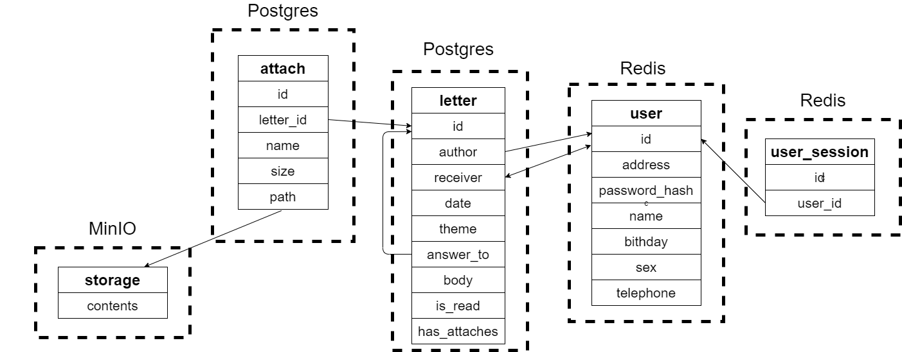

# Highload_Mail_project
## Тема и целевая аудитория
Тема: проектирование высоконагруженного сервиса электронной почты, позволяющего пользователям отправлять и получать письма, которые могут содержать вложения.

Возможности, которые предоставляет пользователю проектируемый сервис:
- Регистрация и авторизация
- Отправка/пересылка писем (письма могут содержать вложения)
- Чтение писем
- Постраничное получение списка последних писем из почтового ящика (последние 50)
- Удаление писем

Согласно [radar.yandex](https://radar.yandex.ru/yandex?month=2021-04), в 2021 году месячная аудитория Яндекс.Почты составляет 16 млн пользователей, а дневная 5.5 млн пользователей.

На основании этих данных обозначим аудиторию проекта:

- Дневная аудитория проекта - 5.5 млн пользователей
- Количество активных аккаунтов - 50 млн (~35% населения России)
- Сервис будет направлен на Российскую аудиторию.

## Расчет нагрузки
Определим данные среднего пользователя почтового сервиса.

Пусть средний пользователь отправляет 3 письма в день, получает 10 писем в день и проверяет почту в среднем [15 раз в день](https://hbr.org/2019/01/how-to-spend-way-less-time-on-email-every-day).

#### RPS по типам запросов:
1. Авторизация:

    Так средний пользователь проверяет почту 15 раз в день (то есть заходит на сайт), то и количество запросов на авторизацию от одного пользователя будет равно 15:
  
    ```RPS = 5.5 * 10^6 * 15 / (24 * 60 * 60) ~ 960```

2. Отправка писем:

    Если считать, что средний пользователь отправляет 3 письма в день, то количество запросов на отправку письма в секунду:
   
    ```RPS = 5.5 * 10^6 * 3 / (24 * 60 * 60) ~ 190```

3. Чтение писем:

    Предполагая, что пользователь читает все полученные за день письма (10 писем):
    
    ```RPS = 5.5 * 10^6 * 10 / (24 * 60 * 60) ~ 636```

4. Постраничное получение списка последних писем из почтового ящика:

    Считая, что пользователь проверяет почту 15 раз в день, получим:
    
    ```RPS = 5.5 * 10^6 * 15 / (24 * 60 * 60) ~ 960```
    
5. Удаление писем:

    Так как по [статистике](https://www.statista.com/statistics/420400/spam-email-traffic-share-annual/) 28% писем являются спамом, то в среднем пользователь будет удалять 3 письма в день:
        
    ```RPS = 5.5 * 10^6 * 3 / (24 * 60 * 60) ~ 190```
    
Итого, получаем среднее количество запросов с секунду: ```RPS ~= 2940```

Рассчитаем траффик, генерируемый пользователями. Пусть в момент пиковой нагрузки сайтом одновременно пользуется 20% суточной аудитории:

```Кол-во пользователей при пиковой нагрузке = 5.5 * 10^6 * 0.7 ~ 1.1 * 10^6```

#### Траффик для различных типов запросов:

#### Переделать
    
## База данных

### Логическая схема базы данных
База данных будет включать следующие основные сущности:

- Пользователь
- Письмо
- Вложение


### Физическая схема базы данных

Для хранения активных сессий пользоветелей будем использовать базу данных Redis, потому что она хранит данные in-memory и имеет поддержку неблокирующей репликации master-slave. 

Для хранения писем и таблицы аттачей будем использовать Postgres. Так как таблица писем содержит огромное число строк, и, даже при посторенных индексах, запросы на получение последних писем конкретного пользователя будут непозволительно долгими, воспользуемся шардингом по user id. Т.е. на конкретном сервере будут храниться строки таблиц letter и attach, принадлежащие лишь некоторому подмножеству пользоветелей.

В связи с этим, для получения писем конкретного пользователя надо сначала определить, на каком сервере лежат его данные. Пусть место хранения данных конкретного пользователя однозначно пределяется по его email, которых записан в таблице user. в таком случае, Целесообразно использовать для хранения данных из таблицы users key-value хранилище, например Redis.

Для хранения файлов аттачей будет использовано s3 хранилище.



Рассчитаем размер, занимаемый каждой таблицей в базе данных:

1. user_session

    По данным из [источника](https://lucasmagnum.medium.com/redistip-estimate-the-memory-usage-for-repeated-keys-in-redis-2dc3f163fdab), одна сессия в redis будет занимать:  ```220 байт```

2. user

    |   id   |     address      |      password_hash     |     name      |  birthday  |   sex   |      telephone      |
    |--------|------------------|------------------------|---------------|------------|---------|---------------------|
    | bigint |    varchar(60)   |      varchar(32)       |  varchar(30)  |    date    |   bool  |     varchar(11)     |
    
    Максимальный вес одного пользователя: ```146 байт```

3. letter

    |   id   |   author   |     receiver     |    date     |      theme      |   answer_to   |        body        |  is_read  |  has_attaches  |
    |--------|------------|------------------|-------------|-----------------|---------------|--------------------|-----------|----------------|
    | bigint |   bigint   |    bigint[10]    |  timestamp  |  varchar(100)   |    bigint     |  varchar(1000000)  |    bool   |      bool      |
    
    Максимальный вс одного письма: ```1000214 байт```

4. attach

    |   id   |    letter_id   |      name     |  size  |       path      |
    |--------|----------------|---------------|--------|-----------------|
    | bigint |     bigint     |   varchar(30) |   int  |   varchar(50)   |
    
    Максимальный размер одного вложения в таблице attach: ```100 байт```
    
    В среднем, один почтовый ящик состоит из 8000 писем. 
    
    #### Нагрузка на базу
    
    #### Описание схемы шардинга

## Выбор технологий

### Backend
В качестве языка для написания бекенда выбран ```golang``` из-за статической типизации, высокой производительности, хорошей поддержки многопоточности и высокой скорости разработки. Также для ```golang``` написано много библиотек для работы с сетью.

### Frontend
Для написания фронтенда будут использоваться ```HTML, CSS, JavaScript``` как стандартные инструменты для frontend-разработки.

Для отдачи статики и балансировки нагрузки будет использован nginx, как проверенный и эффективный инструмент для балансировки нагрузки. Для балансирования нагрузки на nginx можно использовать DNS.

## Схема сервиса
